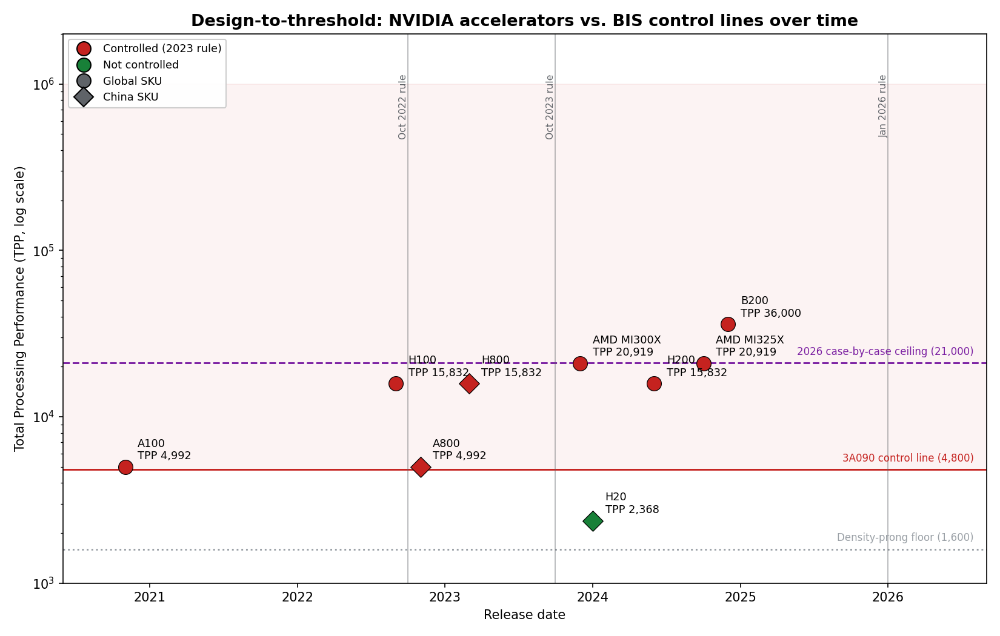

# Export Control Threshold Analysis

Reconstructing the numerical lines in U.S. advanced-computing export controls from
primary regulatory text, and scoring commercial AI accelerators against them over time.

U.S. export controls do not ban "AI chips" — they draw **numerical lines** and
let chip designers spec just below thresholds. The controlling metric, **Total Processing
Performance (TPP)**, is defined in the Export Administration Regulations (ECCN 3A090).
This project implements that definition from the reg text, builds a provenance-tracked
dataset of real accelerators, and classifies each chip under successive rule *vintages*
so that the **migration** of a chip's control status — as the rules change but the
silicon does not — becomes visible and reproducible.

## Headline findings

- **The interconnect loophole, closed.** The NVIDIA A800/H800 kept full compute but cut
  their interconnect below 600 GB/s to escape the **Oct 2022** rule (which required *both*
  high compute *and* high interconnect). The **Oct 2023** rule dropped interconnect and
  switched to TPP, so these parts flip from *free* to *controlled* with no hardware change.
- **Design-to-threshold, quantified.** China-market SKUs cluster just under the lines:
  the A800 lands exactly on the 4,800 TPP line; the H20 is parked at 2,368, low enough to
  also duck the performance-density prong while keeping huge memory bandwidth for inference.
- **Thresholds drawn around specific chips.** The **Jan 2026** case-by-case ceiling
  (TPP < 21,000 **and** DRAM bandwidth < 6,500 GB/s) appears calibrated to *just* admit the
  H200 (15,832 / 4,800 GB/s) and AMD MI325X (20,919 / 6,000 GB/s) while excluding Blackwell
  B200 (36,000). The MI325X clears the TPP bar by 81 and the bandwidth bar by 500.



## The metric (from the reg text)

- **TPP** = `2 x MacTOPS x bit_length`, aggregated over all processing units, evaluated per
  precision on **dense** (no-sparsity) matrices, taking the maximum. In practice
  `2 x MacTOPS` equals the dense TOPS/FLOPS on a datasheet, so
  `TPP(precision) = dense_throughput(precision) x bit_length`.
- **Performance density** = `TPP / applicable_die_area_mm2` (logic die on a non-planar node,
  SRAM included, HBM excluded).
- **ECCN 3A090.a is controlled if** `TPP >= 4800` **or** (`TPP >= 1600` **and**
  `density >= 5.92`).

## Rule vintages modeled

| Vintage | Control test |
|---|---|
| 2022-10-07 | `TPP >= 4800` **AND** `interconnect >= 600 GB/s` (dual criteria; the AND is the loophole) |
| 2023-10-17 | `TPP >= 4800` **OR** (`TPP >= 1600` AND `density >= 5.92`); interconnect dropped |
| 2026-01-15 | Control unchanged; adds a China/Macau license overlay: case-by-case eligible if `TPP < 21000` AND `DRAM_bw < 6500 GB/s`, else presumption of denial |

## Repository layout

```
tpp_calculator.py     Model: Chip class, TPP + performance-density math, thresholds
load_chips.py         Loads the CSVs into Chip objects; validates against ground truth
rules.py              Time-versioned classifier; prints the status-migration matrix
chart.py              Generates figures/headroom.png
data/
  chips.csv           One row per chip: die area, node, bandwidth, interconnect, release, source
  throughput.csv      One row per (chip, precision): dense value, sparsity flag, source
figures/
  headroom.png        The anchor figure
```

## Running it

```bash
pip install -r requirements.txt

python3 load_chips.py   # classify every chip + run validation harness
python3 rules.py        # status by rule vintage + migration report
python3 chart.py        # (re)generate figures/headroom.png
```

`load_chips.py` fails loudly if any of the ground-truth chips (A100, H100, A800, H800, H20,
H200, B200, MI300X, MI325X) is misclassified — it is the regression test for the metric.

## Data conventions (provenance discipline)

- **Dense only.** TPP is defined on dense matrices. `throughput.csv` carries a
  `with_sparsity` flag and the loader **refuses** any row set to `true` — sparse datasheet
  figures must be halved to dense before entry.
- **Every number has a source.** The `source` / `die_area_source` columns record where each
  value came from. `UNVERIFIED` marks values still needing a primary source; `SECONDARY`
  marks values resting on third-party reporting (e.g. the China-only H20, which has no public
  NVIDIA datasheet).
- **Bit length = arithmetic precision** (4/8/16/32/64), never memory bus width.

## Limitations / ambiguity ledger (selected)

- **TF32** is nominally 32-bit but uses ~19 internal bits — its `bit_length` is a defensible
  judgment call the reg does not fully resolve.
- **Performance density is ill-defined for chiplet/multi-die accelerators** (B200, MI300X/X);
  their die area is left blank rather than guessed. Classification is unaffected (all are
  controlled by raw TPP), but the ambiguity is a real regulatory gap.
- The **2026 column is simplified**: the actual policy named specific SKUs and layered KYC,
  testing, and supply conditions; here "case-by-case" means only that a chip meets the two
  numeric criteria.
- The **2022 compute prong** used a precursor metric; modeling it with TPP is an approximation
  for cross-vintage comparability.
- **Release dates** are approximate (month-level estimates) pending verification.

## Primary sources

- ECCN 3A090 and TPP/performance-density definitions: EAR, 15 CFR 774 Supp. 1; Federal
  Register final rules (Oct 2022, Oct 2023, Dec 2024, May 2025 rescission, Jan 2026 revision).
- Chip throughput: manufacturer datasheets (NVIDIA A100 #2188504, H100 #2430615; AMD Instinct
  product briefs). China-only SKUs (H20) rest on corroborated secondary reporting.
